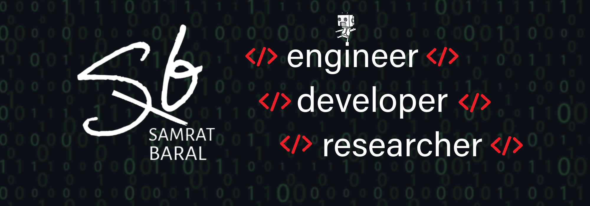

     
  &#8287;&#8287;&#8287;&#8287;&#8287;
  

  

<!-- 
 #only when you want to open it while loading the page!-->

   

   <h2>

   ❖ About Me
   </h2>

   

   
<h2> ❖ Education and Interests </h2>

  
<h2> ❖ Languages & Tools </h2>

  <h3>

  </h3>

  

  

  

  
<h2> ❖ Open Source Contribution</h2>

  

    
  

<!-- 

 -->
<!--  -->

